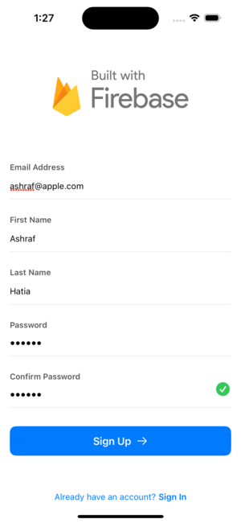
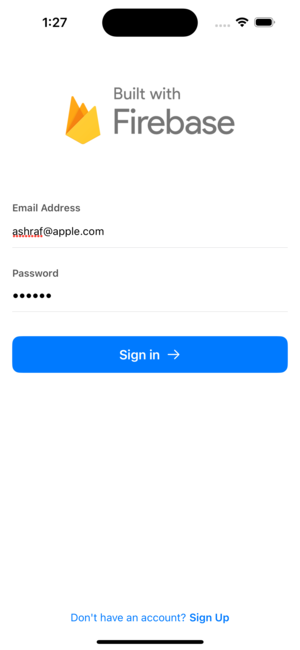
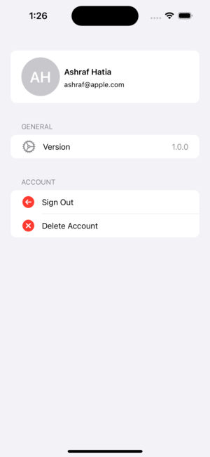

# Swift Firebase Authentication - iOS Project

This iOS project showcases my journey as an iOS developer in implementing Firebase Authentication using Swift and SwiftUI. It features three main views: Login, Registration, and Profile. Through this project, I aimed to demonstrate my learning process and foundational skills in iOS development.

## ⚓ Key Learning Points

- **Introduction to Firebase**
- **Swift and SwiftUI Fundamentals**
- **Building Reusable Components**
- **Form Validation Techniques**
- **iewModel Architecture**

## User Authentication and Management

- **Sign-in User:** Implemented functionality to sign in existing users.
- **Sign-up User:** Implemented functionality to register new users.
- **Sign-out User:** Implemented functionality to sign out currently signed-in users.
- **Delete Account:** Implemented functionality to delete user accounts.
- **Display User Details:** Shows user details on the Profile view page.

## 🌐 Why Showcase This Project?

This project serves as a testament to my dedication and passion for iOS development. Despite being at an entry level, I have demonstrated a willingness to learn and explore new technologies. By showcasing this project, I aim to convey my potential as a motivated and adaptable developer who is eager to contribute to real-world projects.

## Screenshots

##  ☎ Contact

For any inquiries or further discussion about this project or my skills as an iOS developer, please feel free to contact me:

[📧 Mail](mailto:ashrafhatia@gmail.com ) : ashrafhatia@gmail.com 
